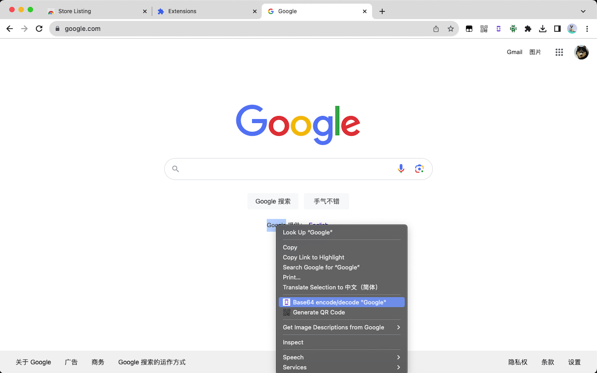
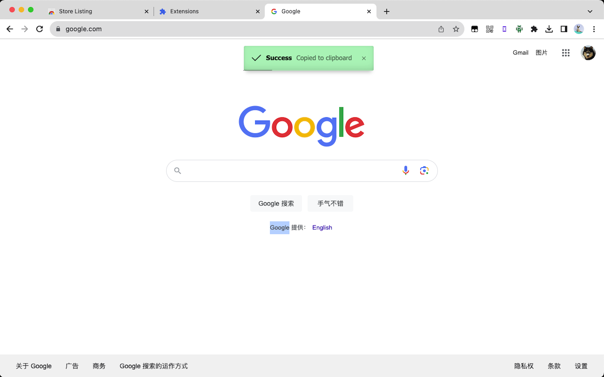

# iBase64

<p align='center'>
    
</p>

[中文](README.zh.md) - English

A simple and minimalistic Chrome extension which can encode plain text to Base64 text and decode Base64 text to plain text.

## Screenshots




## How to install

### Chrome Web Store

Install in [Chrome Web Store](https://chromewebstore.google.com/detail/ibase64/jahlbjgpdcfndhodaajbngjadeagefnp).

### Load an unpacked extension

* Download `iBase64.zip` from [Release](https://github.com/myvin/iBase64/releases) and unzip it
* Go to **chrome://extensions/**
* At the top right, turn on **Developer mode**
* Click **Load unpacked**
* Find and select extension folder `iBase64`

## How to Use

Right click on the selected text to choose `Base64 encode/decode "SELECTED TEXT"`. And the encoded/decoded text will be copied to clipboard. You can paste wherever you need.

## :coffee: Buy Me a Coffee

### BTC

``` copy
3NvpQfHYZtLUtRajGbPdNFnK8in3vyvNqx
```

### ETH

``` copy
0x889408D0A04a1ef32c914A6398f955b83f3554a2
```

## License

[GPLv3](https://www.gnu.org/licenses/gpl-3.0.html)

Copyright (c) 2023-present, myvin